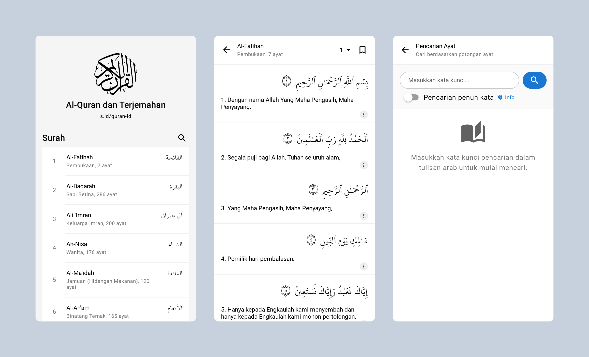

# Al-Quran dan Terjemahan

Al-Quran with Indonesian Translation built with Vue Quasar Framework

## Data source

This app use quran data from [quran.com-api](https://github.com/quran/quran.com-api). Thanks for this great works. Baarakallahu fiihum.

## Install

If you want to run this project into your own development server and maybe making any changes, you can do that by follows these steps below. And please note, use this project for helping people as humanity project (DON'T INCLUDES ANY ADS TO THE APP).

It is also mentioned by the developer of Quran.com, he tell me on Quran.com Discord Server that we can use the data (espesially when I asking for quran images & quran audio from everyayah.com) only if the app is free (no ads, no charge, etc).

About quran audio from everyayah.com
> if your app isn't for money (no ads, etc) and is respectful of the word of Allah then 👍

About quran images from android.quran.com
> you can just use the quran mobile images if it's again for free no charge app etc.

1. Fork/download this project
2. Enter to the project direcotry via CMD/Terminal
3. Run: `npm install`
4. Run: `npm run dev` for development (automatically will opening the browser)
5. Run: `npm run build` for production
6. Enjoy!

**Note:**

For the production build, I use `/quran-id` as the publicPath for building on GitHub Pages. So, maybe you want to change it. Please take a look at `build.publicPath` in quasar.conf.js

## Screenshots

Powered by ngekoding.github.io
